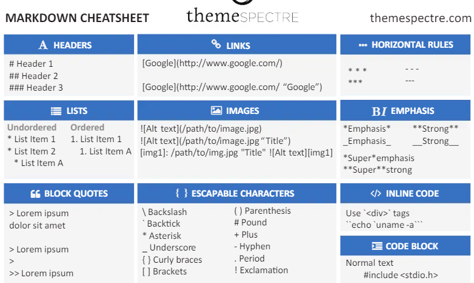

# https://tomascei.github.io/manual-md-fullstack/

```bash
En el caso de que desaparezcan las carpetas del explorador:
comand+p >reset view location
```

```bash
f2 para cambiar todas las variables que se llaman igual
```

# Clase 1

## Como funciona internet
El cloud es un monton de racks con muchos ordenadores.
De nuestro ordanador al router y del router al servidor DNS (Guarda los nombres de los dominios y la direccion IP). Se busca el domino en el más cercano al nuestro, sino la encuantra, pregunta a otro y actializa su tabla de dominios. Pra que la proxima vez que le preguntemos ya tiene el domino y la IP guardados. 
Tambien tiene un  servidor que contiene páginas web en carpetas con el código fuente. Entonces yo me traigo una copia en mi ordenador y el ordenador lee la info y la interpreta en nuestro buscador. 

## Node.JS
Con node.js y javaScript podemos utilizar el mismo lenguaje tanto para front como para back. 
- Front: La lógica que tiene que hacer nuestra compu para morstrar la página web. 
- Back: funciones para traen cosas de nuestro servidor como DDBB y el código que tiene que ejecutar nestra máquina. 


# Clase 2 (Terminal, carpetas, Markdown language)

## Readme.md (Marckdown)
Markdown cheat sheet: Para ver un resumen de como se escribe y se lee los archivos readme.md. https://es.scribd.com/doc/234715992/ThemeSpectre-Markdown-CheatSheet
Ejemplos: ##, ´´´bash ... ´´´ (importante), ´´´html ... ´´´ (para lenguaje html), etc...


Lista: 
- item 1
- item 2
- item 3

Bloque: 

> soy un texto
> en el bloque
> y estoy resaltado

**Italic** y ` Negrita `

La **función flecha** se escribe así `() => {}`


# Clase 3 (Terminal, node, npm, nodemon)

## Terminal

```bash
ls (Lista carpetas)
dir (directorio)
mkdir nombre (crear carpeta nueva)

## crear archivos
- mac:  touch nombre
- windows type nul > nombre-archivo 

## mobimiento carpetas 
cd nombre-carpeta (acceder a un direct
orio)
cd . (misma carpeta)
cd.. (carpeta anterior)
cd / (raiz de nuestro sistema disco c:\) C:
```

## Buscar en visualStudio

```bash
command + p (mac)
ctrl + p (win)
+
> (para acceder a la parte de buscar)
+ 
keyboard shorchuts (abreviaciones de teclado)
```

## Que es node?
Node.js es un entorno de ejecucion de javaSript que permite ejecutar código en el servidor (backend). 

`NOTA: Para repetir código en la consola se usan las flechitas para arriba o para abajo`

```bash
1. Bajar Node.js de la página principal ([nodejs.org](https://nodejs.org/en))
# ver la version que teneos
node -v

# Ejecutar un archivo js
node dia_3/mi.archivo.js
o (dependiendo en donde estemos en las carpetas posicionados)
node mi.archivo.js
```

## Que es NPM o BUN?

- Para instalar BUN: https://bun.sh/
powershell -c "irm bun.sh/install.ps1 | iex"
Entonces en vez de utilizar NPM en la consola, se usa BUN

- NODE PACAGE MANAGER (NPM)
es el administrador de paquetes que viene por defecto en node. 
- Paquetes (Modules): Los paquetes son módulos que se pueden instalar y usar en nuestros proyectos. Por Ejemplo: express, axios, nodemon, chalk, etc. Son conjuntos de funciones que se pueden utilizar y hacen cosas por si solos ya que alguien ya los ha crado. 
Paquetes de npm: https://www.npmjs.com/ (Cowsay para empezar)

## Lenguaje npm

```bash
# Crear mi archivo package.json
npm init 
npm init -y (yes a todo)

# Instalar un paquete nuevo
npm install nombre-paquete
npm i nombre-paquete
npm i nombre-paquete@1.0.0 (Para fozar la instalacion de una versión en concreto)

# Desinstalar un paquete
npm uninstall nombre-paquete

# Actualizar los paquetes a su última versión
npm update (Solo las versiones que tienen un sombrerito delante. Ej: "cowsay": "^1.6.0")

# Flags 
npm init -y  es yes para todo 
npm i nombre-paquete -g  (global) Si pongo -g la carpeta de node_modules se va a instalar globalmente en todo mi servidor y proyectos
npm i nombre-paquete -D  Para instalar dependencias de desarrollador. (devDependencies)

# Nodemon (Node Monitor)
npm i nodemon -D
```

## Instalación de nodemon (Para no escribir node over and over)

```bash
1. npm i nodemon -D (Aparece en el package.json: "devDependencies": {"nodemon": "^3.1.4"})
2. Cambiar el scripts de package.json:
    "start": "node index.js",
    "dev": "nodemon index.js"
3. Si escribimos en la terminal npm run start (Nos ejecuta el código del archivo index.js)
4. Si escribimos en la terminal npm run dev (Nos ejecuta el código del archivo index.js como developer)
    Esto significa que el programa no para, se queda esperando para cualquier cambio de código y si lo hay, lo renderizará de nuevo. 
```


### Ejemplo 1
```bash
https://www.npmjs.com/package/cowsay
1. npm i cowsay
2.  Para que los módulos no se pasen por github para que git no tenga tanta información. 
Crear archivo .gitignore en la raiz de la carpeta y escribir dentro node_modules. 
3. Al crear este archivo, se nos ha creado el package.json y el package-lock.json y los borramos los dos. 
4. Para inicializar el programa ponemos: `NPM init`: 
- package name: mi-primer-proyecto
- version: enter
- description: Estoy haciendo una prueba
- enter point: enter
enter... hasta el final
Esto nos crea el package.json con los parametros de nuestro proyecto (Es la configuracion de nuestro proyecto)
NOTA: Las Dependencias y devDependencies son los más importantes . 
5. Elimino todas las dependencias y volvemos a intalar cowsay. 
npm i
npm i cowsay
(me instala las dependencia necesarioas para que mi archivo funciones, como yo le he quitado todas las dependecias me instalará solo las necesarias)
6. Copiamos y pegamos el código necesario para que corra el programa.
7. node primer_archivo.js
```

### Ejemplo 2
```bash
1. mkdir ejemplo2
2. cd ejemplo2
3. npm init (Como se llama nuestro proyecto...) todo enter
Hasta aquí me crea el package.json vacío
4. npm i cowsay
5. Ya que en el pakage.json dice "main": "index.js": Creamos el archivo index.js
6. Pegamos el código de cowsay
7. node index.js
```

### required (Imports con required)
const cowsay = require("cowsay");
Esto importa la librería que quería usar

### Ejemplo 3 Qr
```bash
1. mkdir ejemplo2
2. cd ejemplo2
3. npm init -y
4. npm i nodemon -D
5. Qr terminal: https://www.npmjs.com/package/qrcode-terminal
    npm install qrcode-terminal
6. crear index.js
7. const miQr = require('qrcode-terminal');
8. miQr.generate('URL');
9. Añadir los scripts:"start": "node index.js",  "dev": "nodemon index.js"
10. npm run dev
```


# Clase 4 (Repaso de Arrays)
Lista de valores. 

```js 
const listaMago = 
[
    {nombre: "Harry". apellido: "Potter", casa: "Gryffin"},
    {nombre: "Hermiony". apellido: "Granger", casa: "Gryffin"},
    {nombre: "Draco". apellido: "Malfoy", casa: "Slytherin"},
    {nombre: "Jhon" apellido: "Deer", casa: "HufflePuff", atacar: ()=>{}}
]
```

## Devolución de Metodos de Array 
### Los más usados
- .forEach()  // NO DEVUELVE NADA solo recorre
- .map()  // DEVUELVE UN NUEVO ARRAY (modifica al array original)
- .filter() // Devueleve un ARRAY que cumpla una condicion (Ej: edad > 18) (UN ARRAY)
- .find() // Devuelve el ELEMENTO que cumple la condicion (UNO SOLO)

### Menos usados
- .some() // Devuelve un booleano si cumple la condicion
- .every() // Devuelve un BOOLEANO  si TODOS cumplen la condicion
- .findIndex // Devuleve el INDICE del elemento que cumpla la condicion


```js
// Ejemplo devolver una lista con todos los mago de Griffi
1. 
listaMago.filter(filtrarUsuarios)

function filtrarUsuarios (valor) {
    return valor.casa == Gryffin
}

2. 
// Saco la funcion y la meto dentro del parentesis
listaMago.filter((valor) => {
    return valor.casa == Gryffin
})

3. 
// Como el código tiene una sola línea se borra los corchetes y la palabra return
listaMago.filter((valor)  => valor.casa == "Gryffin")
listaMago.filter((valor)  => valor.nombre == "Harry")

4. 
//guardo los datos en un let o const
const magosListaGryffin = listaMago.filter (valor  => valor.casa == "Gryffin")  //Me devuelve un Array. Si no encuentra nada devuelve un Array vacío.
const magosHarry = listaMago.find (valor  => valor.nombre == "Harry")  //Me devuelve un elemento. 

## Template strings 
const nombre = "Laura"
'Hola soy un conmentario de comillas simples'
"Hola soy un conmentario de comillas simples"
`Hola soy un comentario con template strings ${nombre}`
```

## Comentario de función JSDocs
```js
/**
 * Buscar una obra, a partir de un título
 * @param {string} title - el título de la obra 
 * @param {string} artist - el artista de la obra 
 * @returns {object | {error: 404 , title: string} } - la obra encontrada o error
 */

const findArt = (title, artist) => {
    // paso el título a minúsculas (toLowercase) y le quito espacios delante y detras (trim)
    title = title.toLowerCase().trim();

    const result = ArtGallery.find( obra =>  obra.title.toLowerCase() === title);
    if(!result) {
        return { msg: "Obra no encontrada", error: 404 }
    }
    return result;
}

console.log("Buscando Starry Night: ", findArt("Starry Night"));
console.log("Buscando    StaRrY nIght: ", findArt("   StaRry nIght"));
console.log("Buscando The Matrix: ", findArt("The Matrix"));


# Clase 5 (Deconstruccion de objetos o arrays)

Nos extrae cada propiedad de un objeto y las pone solo en una variable. 

```js
const alumno = {
    nombre: "Laura"
    edad; 23,
    asignatura: "FullStack"
}

function imprimir(props)

//Forma tradicional
const edad = props.edad
const nombre = props.nombre
const asignatura = props.asignatura


//MEJOR HACER ESTO, DECONSTRUCCION
// deconstrucccion de objetos (Los extraigo y creo variables dentro del const en vez de escribir las variables uan tra otra)
const {edad, nombre, asignatura} = props;
console.log(`Mi nombre es ${nombre} tengo ${edad}...`)

// Me puede pasar que ciando importo un archivo, ya tenga una variable con el mismo nombre, Por lo que para llamar esa variable en el archivo en el que esrtoy trabajando pongo DOS PUNTOS :
// Entonces renombro la variable nombre por :miNombre Ej:
const nombre = "Juanito"
const {edad, nombre:miNombre, asignatura} = props;
console.log(`Mi nombre es ${miNombre} tengo ${edad}...`)

// Deconstrucción de arrays (Tiene la misma cantidad de elementos que de valores y van en línea, no como los objetos que se define mediante el nombre de la variable)
const lista = ["item1", "item2", "item3"];
const [val1, val2, item3] = lista;

```


# CommonJS y ECMAScripts Modules (ESM) 
### Diferencias: Asincorona y sincrona, manera de llamralas al importarlas y que el ESM trabaja tanto en el back como en el front.

En JS los modulos son porciones de código reutilizables que se pueden importar y exportar entre diferentes carpetas. Estos permiten organizar y reutilizar el código de manera eficiente.

## CommonJS

Fue creado para node.js (Nuestro entorno de trabajo del Backend)

- Se cargan de manera sincrona (es decir, el programa espera a que el modulo cargue antes de continuar)
- No es comun, pero se puede usar en el navegador con ayuda de herraminetas como Browserify / WebPack / Parcel

```js
//***********************************************
// Importacion de un solo elemento (SIN LLAVES)
//archivo1.js
const mensaje = "Hola mundo"
const mensaje2 = "Adios alumnos"
module.exports = mensaje

//archivo2.js
const mensaje = required("./archivo1")  //cuando es el navegador no hace falta ponerle .js pero en otros si...
const mensaje2 = required("./archivo1")

//***********************************************
// Importacion de múltiples elementos (OBJETOS CON LLAVES)
//archivo1.js
const mensaje = "Hola mundo"
const mensaje2 = "Adios alumnos"
module.exports = mensaje
module.exports = {mensaje, mensaje2}

//archivo2.js (Importo variables con llaves ya que estoy importando objetos)
const {mensaje} = required("./archivo1") 
o
const {mensaje , mensaje2} = required("./archivo1") 

```


## ECMAScript ES6 (ESM)

Fue introducido en ECMAScript 2015 (ES6) para estandarizar los modulos de JS. Se usa para front (navegadores) como back (NodeJs)

- Los modulos se cargan de manera asincrona (Es decir, el programa continua mientras los módulos se cargan)
- Soportado en navegadores modernos y en versiones receiente s de NodeJs.


```js
// Importacion de múltiples elementos
//archivo1.js
export default const mensaje1 = "Hola mundo"  //default SIN LLAVES en el import (SOLOS HAY UNO EN EL ARCHIVO)
export const mensaje2 = "Adios alumnos"  // los export se importan CON LLAVES
export const mensaje3 = "Volvi"


//archivo2.js (Default con llaves, exprot sin llaves)
import mensaje1 from "./archivo1"
import { mensaje2, mensaje3 } from "./archivo1"
//Como es el export por default no hace falta que se llame igual, lo podemos llamar como queramos. Ej: 
import miMensaje from "/archivo1"

Console.log(mensaje1, miMensaje, mensaje2, mensaje3)
//  "Hola mundo",  "Hola mundo", "Adios alumnos", "Volvi"
```

Para definir que sistema de los dos que hemos visto, haremos los siguiente: En el bakend modificaremos el paquete package.json, debajo del main ("Type": "module" o "Type": "communJs")
Con vite se agrega solo ("Type": "module")
```js
{
  "name": "dia4",
  "version": "1.0.0",
  "main": "index.js",
  ****"type": "module"****
  "scripts": {
    "test": "echo \"Error: no test specified\" && exit 1"
    .........
}

```


En el frontEnd si queremos usar type=modeles, cambiaremos la etiqueta de script:
```html
<script type="module" src=".....">
```

# React (Vite) (Vite es un entorno de desarrollo frontend)

Es una biblioteca de JS para construir interfaces de usuarios(facebook 2013).
React es FRONTEND. Será back caundo traiga bases de datos, ect...

Diferencia entre librería y frameworks
Librería (soluciona parte de nuestro código, nos ayuda a hacer ciertas cosas. Nos permite hacer interfaces completas) y framework (NextjsS, Remix, Expo) (sistema que nos soluciona nuestro codigo de punta a punta).


[vitejs.dev](https://vitejs.dev/)

```bash
PASOS:
1. npm create vite@latest  /  nombra carpeta(vite_react) / React  /  JavaScript   
2. cd nombreProyecto (vite-react)
3. npm install  (Para crear los módulos)
4. npm run dev (ejecuta vite)
```

control+http://localhost:5173/ (Abre la pagina en localHost)

```bash
IMPORTANTE: EL return solo devuleve UNA etiqueta. Esta, puede tener + etiquetas dentro. Para eso se utiliza la etiqueta vacía.

  return (
    <>
    </>
  )
```

### Componentes <Alumno/>

Un componente es una FUNCIÓN que Devuelve una etiqueta reutilizable. Tiene que estar en un archivo .jsx tiene que ser importada y exportado

```bash
IMPORTANTE: Los componentes van en mayusculas PascalCase 
```


## Componentes dentro de react
```bash
NOTA: LAs variables e pueden usar dentro del jsx entre llaves. Ejemplo: 
Conts nombre = "Nombre"
  <h1>Mi nombre es {Nombre}</h1>


COMENTARIOS: Van entre llaves. Ej: 
{/*Este es un comentario en js*/}

```

1. Se pueden utilizar componenetes que están directamente dentro del App.jsx
NO ES LO NORMAL

```js
App.jsx
function App() {

  const Nombre = "Marta" // Constante texto

  return (
    <>
      <h3>Mi página: {Nombre}</h3> 
      <MiTarjeta />
    </>
  )
}
export default App

// Función normal
function MiTarjeta () {
  return(
    <h3>Esta es mi tarjeta!!</h3>
  )
}
// Función flecha
const MiTarjeta = () => {
    return(
        <div>Esta es mi tarjeta</div>
    )
}
```

2. Components fuera del archivo App: Creamos la carpeta llamada components. 
3. Creamos un archivo que se llama igual que la funcion que vamos a utilizar. MiTarjeta.jsx
4. Escribimos la función necesaria y hacemos un Export MiTarjeta (default o normal)
5. En App.jsx hacemos el import 
import MiTarjeta from './components/MiTarjeta' (default o {normal})

```js
App.jsx
// CON EXPORT DEFAULT
import './App.css'
import MiTarjeta from './components/MiTarjeta'

function App() {
  const Nombre = "Marta"

  return (
    <>
      <h3>Mi página: {Nombre}</h3>
      <MiTarjeta />
    </>
  )
}
export default App

// CON EXPORT NORMAL
import './App.css'
import {MiTarjeta, MiMensaje} from './components/MiTarjeta'

function App() {

  const Nombre = "Marta"

  return (
    <>
      <h3>Mi página: {Nombre}</h3>
      <p>{MiMensaje}</p>
      <MiTarjeta />
    </>
  )
}
```

```js
MiTarjeta.jsx
// CON EXPORT DEFAULT
const MiTarjeta = () => {
    return(
        <div>Esta es mi tarjeta</div>
    )
}

export default MiTarjeta

// CON EXPORT NORMAL
export const MiTarjeta = () => {
    return(
        <div>Esta es mi tarjeta</div>
    )
}

export const MiMensaje = "Hola a todos"

```

EJERCICIO: Crea un componente llamado Card, que imprima por pantalla:
- Nombre
- Edad
- 3 hobbies

```js
Card.jsx
const Card = () => {
    const nombre = "Marta";
    const edad = 37
    const hobbies = ["Caca1", "Caca2", "Caca3"]
    return(
        <>
            <h3>{nombre}</h3>
            <p>Mi edad es {edad}</p>
            <p>Mis hobbies</p>
            <ul>
                {
                    hobbies.map( (hobby) => {
                        return(
                            <li>{hobby}</li>
                        )
                    })
                }
            </ul>
        </>
    )
}
export default Card;
```

```js
App.jsx
import Card from './components/Card'
function App() {

  return (
    <>
      <Card></Card>
    </>
  )
}
```

### Mandar propiedades desde un padre a un hijo
Se quitan las propiedades (const) y se ponen sin valor detro de las propiedades de la funcion. 
```bash
Se desconstruyen en el hijo
```
- NO - const nombre = "Marta"; const edad = 37 
- SI - const Card ({nombre, edad, hobbies}) => ...
Es decir, no se declaran las propiedades en el hijo, se declaran en el padre (App.jsx)

```js
const Card = ({nombre, edad, hobbies}) => {
    return(
        <>
            <h3>{nombre}</h3>
            <p>Mi edad es {edad}</p>
            <p>Mis hobbies</p>
            <ul>
                {
                hobbies.map( (hobby) => {
                    return(
                        <li>{hobby}</li>
                    )
                })
                }
            </ul>
        </>
    )
}
export default Card;
```

```js
import Card from './components/Card'
function App() {

  return (
    <>
      <Card nombre={"Marta"} edad={"36"} hobbies={["Caca1", "Caca2", "Caca3"]}/>
    </>
  )
}
```

### Darle estilos a los componentes 
Ponerle a la etiqueta de html el className="card"
Al hijo por ejemplo:
```js
const Card = ({nombre, edad, hobbies}) => {

    return(
        <div className="card">
          .....
        </div>
    )
}
```

```css
.card {
  padding: 2em;
  border: 2px solid black;
  border-radius: 1rem;
}
```


